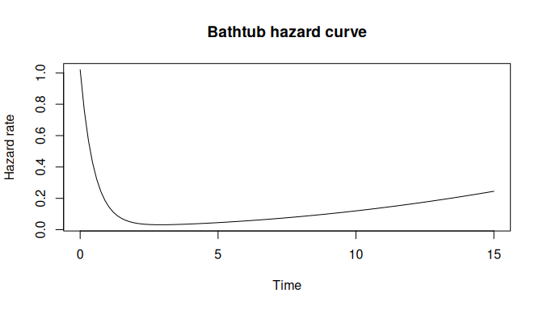
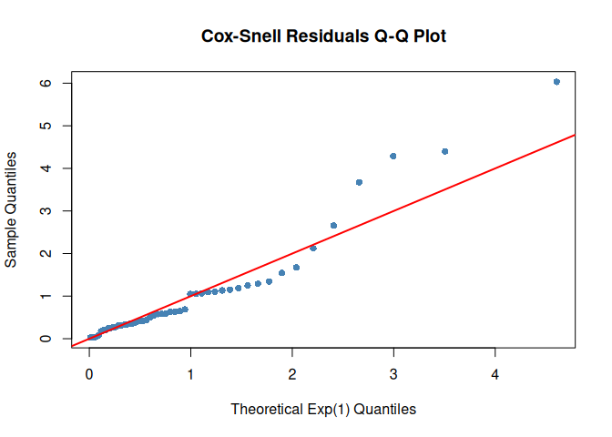

- [dfr.dist](#dfrdist)
  - [Why dfr.dist?](#why-dfrdist)
  - [Features](#features)
  - [Installation](#installation)
  - [Quick Start](#quick-start)
    - [Built-in Distributions](#built-in-distributions)
    - [Maximum Likelihood Estimation](#maximum-likelihood-estimation)
    - [Custom Hazard Functions](#custom-hazard-functions)
    - [Model Diagnostics](#model-diagnostics)
  - [Mathematical Background](#mathematical-background)
  - [Likelihood for Survival Data](#likelihood-for-survival-data)
  - [Documentation](#documentation)
  - [Related Packages](#related-packages)

<!-- README.md is generated from README.Rmd. Please edit that file -->

# dfr.dist

<!-- badges: start -->

[](https://github.com/queelius/dfr_dist/actions)
<!-- badges: end -->

**Dynamic Failure Rate Distributions for Survival Analysis**

The `dfr.dist` package provides a flexible framework for specifying
survival distributions through their **hazard (failure rate)
functions**. Instead of choosing from a fixed catalog of distributions,
you directly specify the hazard function, giving complete control over
time-varying failure patterns.

## Why dfr.dist?

| Feature                    | dfr.dist                             | survival     | flexsurv |
|----------------------------|--------------------------------------|--------------|----------|
| Custom hazard functions    | **Yes**                              | No           | Limited  |
| Built-in distributions     | Exp, Weibull, Gompertz, Log-logistic | Weibull, Exp | Many     |
| Automatic differentiation  | **Yes** (via femtograd)              | No           | No       |
| Exact Hessian computation  | **Yes**                              | No           | No       |
| Likelihood model interface | **Full**                             | Basic        | Partial  |
| Right-censoring support    | Yes                                  | Yes          | Yes      |

## Features

- **Flexible hazard specification**: Define any hazard function h(t,
  par, …)
- **Built-in distributions**: Exponential, Weibull, Gompertz,
  Log-logistic with optimized implementations
- **Complete distribution interface**: hazard, survival, CDF, PDF,
  quantiles, sampling
- **Likelihood model support**: Log-likelihood, score, Hessian for MLE
- **Automatic differentiation**: Exact gradients and Hessians via
  femtograd integration
- **Model diagnostics**: Residuals (Cox-Snell, Martingale) and Q-Q plots
- **Censoring support**: Handle exact and right-censored survival data
- **Ecosystem integration**: Works with `algebraic.dist`,
  `likelihood.model`, `algebraic.mle`

## Installation

Install from GitHub:

``` r
# install.packages("devtools")
devtools::install_github("queelius/dfr_dist")
```

## Quick Start

``` r
library(dfr.dist)
```

### Built-in Distributions

Use the convenient constructors for classic survival distributions:

``` r
# Exponential: constant hazard (memoryless)
exp_dist <- dfr_exponential(lambda = 0.5)

# Weibull: power-law hazard (wear-out or infant mortality)
weib_dist <- dfr_weibull(shape = 2, scale = 3)

# Gompertz: exponentially increasing hazard (aging)
gomp_dist <- dfr_gompertz(a = 0.01, b = 0.1)

# Log-logistic: non-monotonic hazard (increases then decreases)
ll_dist <- dfr_loglogistic(alpha = 10, beta = 2)
```

All distribution functions are automatically available:

``` r
S <- surv(exp_dist)
S(2)  # Survival probability at t=2
#> [1] 0.3678794

h <- hazard(weib_dist)
h(1)  # Hazard at t=1
#> [1] 0.2222222
```

### Maximum Likelihood Estimation

``` r
# Simulate failure times
set.seed(42)
times <- rexp(50, rate = 1)
df <- data.frame(t = times, delta = 1)

# Fit via MLE
solver <- fit(dfr_exponential())
result <- solver(df, par = c(0.5), method = "BFGS")
coef(result)  # Estimated rate
#> [1] 0.8808457
```

### Custom Hazard Functions

Model complex failure patterns like bathtub curves:

``` r
# h(t) = a*exp(-b*t) + c + d*t^k
# Infant mortality + useful life + wear-out
bathtub <- dfr_dist(
  rate = function(t, par, ...) {
    par[1] * exp(-par[2] * t) + par[3] + par[4] * t^par[5]
  },
  par = c(a = 1, b = 2, c = 0.02, d = 0.001, k = 2)
)

h <- hazard(bathtub)
curve(sapply(x, h), 0, 15, xlab = "Time", ylab = "Hazard rate",
      main = "Bathtub hazard curve")
```



### Model Diagnostics

Check model fit with residual analysis:

``` r
# Fit exponential to data
fitted_exp <- dfr_exponential(lambda = coef(result))

# Cox-Snell residuals Q-Q plot
qqplot_residuals(fitted_exp, df)
```



## Mathematical Background

For a lifetime $T$, the hazard function is: $$h(t) = \frac{f(t)}{S(t)}$$

From the hazard, all other quantities follow:

| Function          | Formula                   | Method      |
|-------------------|---------------------------|-------------|
| Cumulative hazard | $H(t) = \int_0^t h(u) du$ | `cum_haz()` |
| Survival          | $S(t) = e^{-H(t)}$        | `surv()`    |
| CDF               | $F(t) = 1 - S(t)$         | `cdf()`     |
| PDF               | $f(t) = h(t) \cdot S(t)$  | `density()` |

## Likelihood for Survival Data

For exact observations: $\log L = \log h(t) - H(t)$

For right-censored: $\log L = -H(t)$

``` r
# Mixed data with censoring
df <- data.frame(
  t = c(1, 2, 3, 4, 5),
  delta = c(1, 1, 0, 1, 0)  # 1 = exact, 0 = censored
)

ll <- loglik(dfr_exponential())
ll(df, par = c(0.5))
#> [1] -9.579442
```

## Documentation

**Getting Started:**

- [Quick Start
  Guide](https://queelius.github.io/dfr_dist/articles/getting_started.html) -
  5-minute introduction
- [Dynamic Failure Rate
  Distributions](https://queelius.github.io/dfr_dist/articles/failure_rate.html) -
  Core concepts

**Creating Custom Distributions:**

- [Creating Custom
  Distributions](https://queelius.github.io/dfr_dist/articles/custom_distributions.html) -
  Build your own
- [Automatic
  Differentiation](https://queelius.github.io/dfr_dist/articles/automatic_differentiation.html) -
  Exact derivatives

**Applications:**

- [Reliability
  Engineering](https://queelius.github.io/dfr_dist/articles/reliability_engineering.html) -
  Real-world examples
- [Function Reference](https://queelius.github.io/dfr_dist/reference/)

## Related Packages

- [`algebraic.dist`](https://github.com/queelius/algebraic.dist):
  Generic distribution interface
- [`likelihood.model`](https://github.com/queelius/likelihood.model):
  Likelihood model framework
- [`algebraic.mle`](https://github.com/queelius/algebraic.mle): MLE
  utilities
- [`femtograd`](https://github.com/queelius/femtograd): Forward-mode
  automatic differentiation
